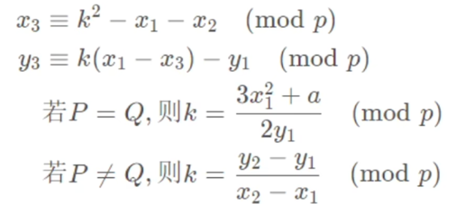

# 数学知识
## 群
群是指一个集合G和一个二元运算构成的代数结构，满足以下四个基本条件：

1.  封闭性：对于群G中的任意两个元素a和b，它们的运算结果ab也属于群G。

2.  结合律：对于群G中的任意三个元素a、b和c，它们的运算结果符合结合律，即(ab)c = a(bc)。

3.  存在单位元素：存在一个元素e属于群G，使得对于群G中的任意一个元素a，a乘以e的结果等于a，即ae = ea = a。

4.  存在逆元素：对于群G中的任意一个元素a，存在一个元素b属于群G，使得a乘以b的结果等于群G的单位元素e，即ab = ba = e。

此集合关于此二元运算形成了一个群(G,+)。 群的元素可以是数、集合、点坐标等
椭圆曲线一般用加法、乘法。

## 域
满足两个二元运算（加法、乘法）的群（加法和乘法各自构成一个群。）
加法满足交换律、结合律、有零元、有负元
乘法满足交换律、结合律、有单位元、有逆元

### 有限域

也称为伽罗华域，是一种由有限个元素组成的域
元素的个数称为有限域的阶n, n一定是某个素数的正整数次幂, n = pᵐ , 标识为GF（pᵐ）
既要有限，就要取模。
x3 ≡ k² - x1 - x2 (mod p)
y3 ≡ k(x1 - x3) - y1 (mod p)
    

## 威尔斯特拉斯方程
威尔斯特拉斯方程（Weierstrass）：y² + axy + by = x³ + cx² + dx + e （a、b、c、d、e是常数）。
通过坐标变换转换为：y² = x³ + ax + b。
在满足4a³ + 27b² ≠ 0 时成一条非奇异曲线。

## 椭圆曲线
椭圆曲线是一种数学曲线：y² = x³ + ax + b的方程来描述，其中a和b是常数，且满足4a³ + 27b² ≠ 0 (保证曲线平滑，都有切点)。

椭圆曲线具有以下基础概念和性质：

1.点的坐标：椭圆曲线上的点可以用二元组（x，y）表示，其中x和y都是实数或复数。

2.垂直性质：椭圆曲线是对称于x轴和y轴的，也就是说，如果（x，y）是椭圆曲线上的一个点，那么（x，-y）和(-x，y)也是。

3.封闭性质：如果（x1，y1）和（x2，y2）是椭圆曲线上的点，那么它们的和（x3，y3）也是椭圆曲线上的点。

4.椭圆曲线的加法是通过从（x1，y1）和（x2，y2）开始，沿着曲线绘制一条直线，找到与曲线的第三个交点来计算的。

5.无穷远点：椭圆曲线上还有一个特殊的点，称为无穷远点，通常用O表示。
    它不在椭圆曲线上，在椭圆曲线的加法运算中，将无穷远点作为加法中的零元素，即任何点加上无穷远点等于其本身，无穷远点加上任何点等于该点本身。

6.群结构：椭圆曲线上的点满足一个群结构，可以进行加法和数乘（将一个整数乘以一个点）。

7.这个群结构具有封闭性、结合律、交换律、存在单位元素和逆元素等基本性质。

### 几何性质

1. 假如椭圆曲线上三点A、B、C在一条直线上，他们的和为O。
2. 对于椭圆曲线上一点P = （x, y）,逆元-P = （x, -y）。P + (-P) = O
3. 椭圆曲线上沿点A、B做条直线，必交与点R，对点R做x轴对称得到曲线点R` = A + B
4. 2倍点Q的计算,Q的切线交与点T：Q + Q + T = O  -->  Q + Q = 2Q = -T

### 代数性质
对于点P（x1, y1）、Q(x2, y2),
计算点 S (x3, y3) = P + Q

x3≡k^2-x1-x2(mod p)

y3≡k(x1-x3)-y1(mod p)

若P=Q 则 k= (3 * x1^2 + a) / 2 * y1 (mod p)

若P≠Q，则k= (y2 - y1) / (x2 - x1) (mod p)

## 离散对数难题
Q = k * P （Q、P 是椭圆曲线的两个点，k是一个大数）

已知k、P求解Q容易

已知Q、P求解k难

# 常见用法

## 产生密钥
### ECC算法：
私钥：随机数, d∈[1, n-1],
公钥：P = dG
### SM2算法：
私钥：随机数 d∈[1, n-2]
公钥：P = d * G

## 加解密
### ECC:
加密：
明文为M，产生随机数r (大数，同d)
C = （C1, C2）=（rG,  M + rP ）
解密：
C2 – dC1
= M + rP – drG
= M + rdG – drG
= M

### SM2:

产生随机数 k∈[1, n-1]
C1 = k * G
k * P = (x2, y2)
t = KDF (x2 || y2,klen)
C2 = M⊕t
C3 = hash(x2 || M || y2)
C = C1 || C2 || C3
验证C1是否在椭圆曲线的点
d * C1 = (x2, y2) = d * k * G = k * P
同样计算t，M` = t ⊕ C2
计算C`3 = hash(x2 || M` || y2)
判断 C`3 == C3

## 签名验签
### ECC：
签名：
选择一个hash函数，对原文进行摘要处理得到h。
选择一个随机数r， r∈[1, n]
计算点 R = r * G。
计算S = (h + dA * Rx) / r，默认都有 mod n。其中dA是私钥，Rx是点R的x坐标值。
如果S等于0，则返回到步骤5a，重新选择r。否则，签名就是(R, S)。
验签：
计算点u1 = (h * G )/s  + RP/s。
计算点u2 = s^-1 * P。
计算点V = u1 + u2。
如果V的x坐标值等于R的x坐标值，则验证成功；否则，验证失败。

### SM2
签名：
摘要需公钥参与：Z = H₂₅₆(ENTLa || ID || a || b || xG || yG || xA || yA)
M` = Z || M
e = Hash(M`)
产生随机数 k∈[1, n-1]
k * G = (x1, y1)
r = (e + x1) mod n
s = ((1 + d)⁻¹ * (k – r * d)) mod n
（r, s）

验签：
计算摘要e`
t = r + s
s * G + t * P = (x1, y1)
r` = e` + x1
比对 r` == r

